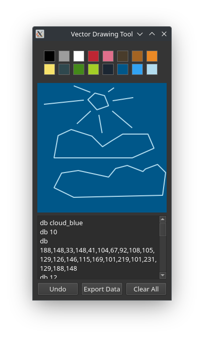

# VectorShop

A pixel-perfect vector drawing tool for assembly-style game assets, featuring color-name-based export and real-time editing.



## Features

- **256×256 Canvas**: Perfect square workspace for pixel art assets
- **Named Color System**: 16 predefined colors with semantic names
- **Smart Drawing Tools**:
  - Click-to-place vertices
  - Shift+Click for continuous drawing
  - Shift+Enter to close shapes
  - Real-time preview lines
- **Color Management**:
  - Left-click colors to change line color
  - Right-click colors to change background
  - Global color updates (changing color affects existing lines)
- **Assembly-Style Export**:
  ```asm
  db <color_name>
  db <line_count>
  db <coordinates>
  db 0```

## Installation

Clone repository:

```
git clone https://github.com/yourusername/vectorshop.git
cd vectorshop
```
Install dependencies:

```
pip install pyqt5
```

Run application:
```
python vectorshop.py
```